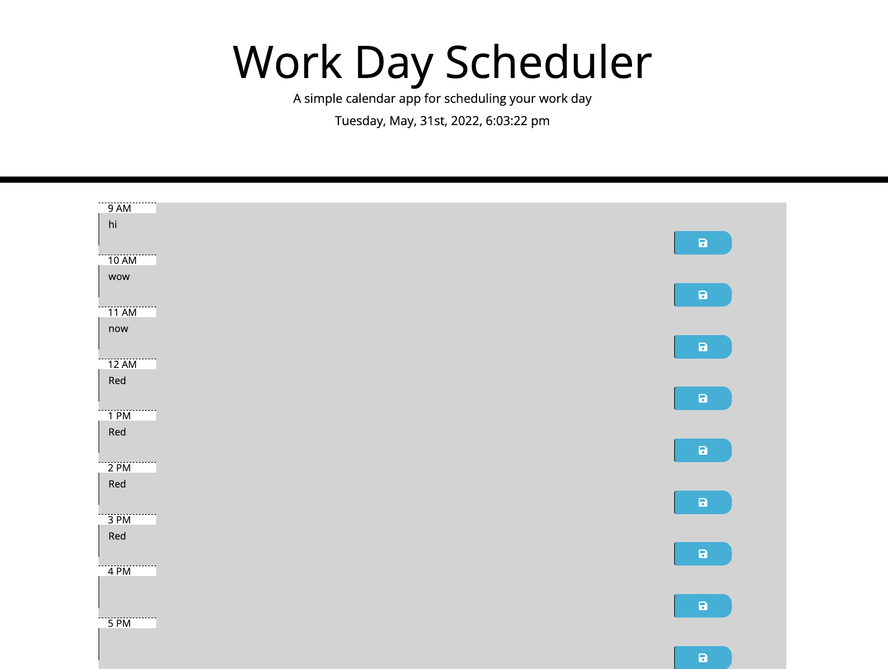

# workdayscheduler

## Table of Contents
- [Desription](#description)
- [Visuals](#visuals)
- [Resources](#resources)

## Description

This is a work day planner where the date is displayed at the top.
When you scroll down you are presented with timeblocks with standard buisness hours.
Each timeblock is color coded to indicate whether it its in the past, present, or future. When you click a timeblock you can enter an event.That text is saved to local storage, and when you refresh the saved events persist.

## Visuals

## Resources
- [Live Site](https://gcoder9.github.io/workdayscheduler/)
- [Repository](https://github.com/Gcoder9/workdayscheduler)